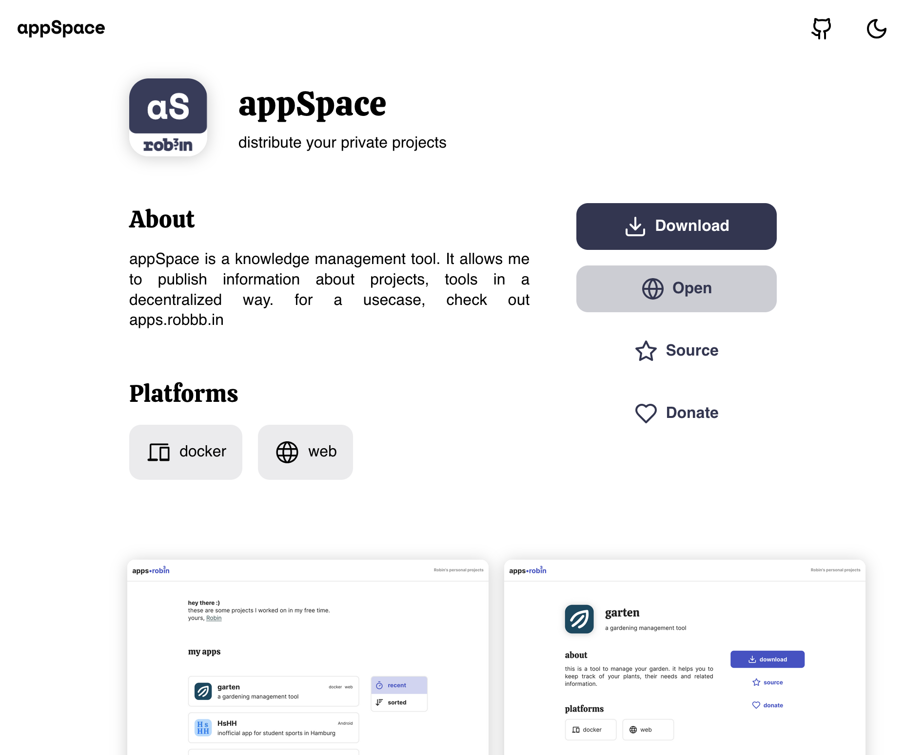
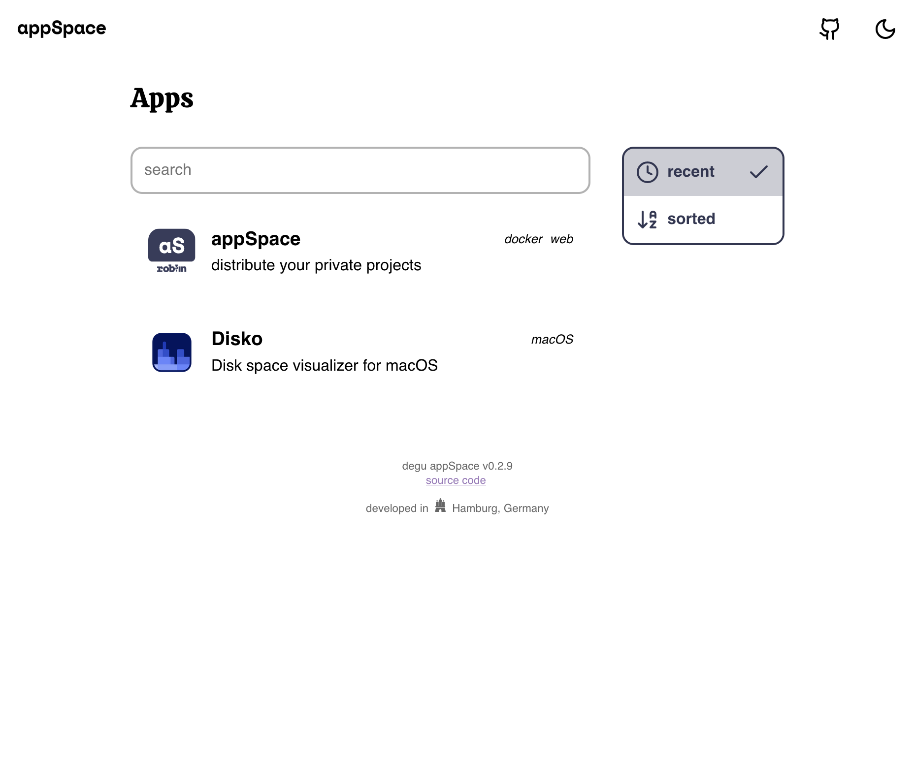

# appSpace | degu __

**appSpace** is a simple web app that displays a collection of apps. The apps are defined in a `degu.yaml` file. The appSpace fetches the information from the file and displays it in a nice and clean way. The appSpace is built using `preact` and `typescript`.

You can see a demo **[here](https://apps.robbb.in)**.

The app is part of the **[degu](#degu)** system.

### Screenshots

__
__

### Install

#### Static Hosting

You can host the appSpace on any static hosting provider. Just upload the content of the `docs` directory to the server and you're good to go.

> 💡 If you are using a provider like github pages or similar, make sure to set `spa` to `true`.
>
> As a [demo](https://robinnaumann.github.io/appspace/), the `docs` folder of this repo is hosted on github pages.

#### Docker

You can install the appSpace using Docker. I would strongly advise you to use docker-compose with something like `traefik` for HTTPS support.
A minimal `docker-compose.yaml` file could look like this:

```yaml
services:
  appspace:
    image: registry.gitlab.com/constorux/appspace
    ports:
      - "80:80"
    volumes:
      - ./degu.yaml:/app/degu.yaml
```

#### Configuration

Your appSpace needs a `degu.yaml` file. This file defines the apps you want to display. You can find an example file [here](https://raw.githubusercontent.com/RobinNaumann/appSpace/main/degu.yaml). For the degu system, you can find documentation below.

The file should look like this:

```yaml
type: appspace_config
config:
  #title:              (string) The title displayed on the top
  #message:            (string) The message displayed on the top
  #imprint:            (string) link to your imprint

  #logo:               (string) link to your logo
  #logo_dark:          (string) link to your dark logo (for dark mode)
  #logo_height:        (number) height of the logo in rem

  #theme_dark:         (true|false|'auto') whether to use dark mode
  #theme_accent:       (string) the accent color in #hex

  #show_source_button: (boolean) show a link to this repository
  #show_dark_button:   (boolean) show a dark mode toggle

apps:
  appspace:
    ref: https://raw.githubusercontent.com/RobinNaumann/appspace/main/degu.yaml
  disko:
    ref: https://raw.githubusercontent.com/RobinNaumann/disko/main/degu.yaml
```

### Contribute

I'm happy about any kind of contribution. Just open an issue or a pull request. The project is written using `preact` and `typescript`.

### Feedback

If you have any feedback, feel free to contact me. You can also open an issue.

Yours, Robin

# degu

_degu_ is a system for storing knowlege in a structured and de-centralized way. It is broadly based on the idea of a graph database, but with a focus on simplicity and ease of use.

> **example**: Instead of having information about all your apps directly on your server, you can store them **in the individual repositories** (or gists) in a `degu.yaml` file.
>
> This way, you can easily update the information without having to access the server. On the server, you only reference the URL of the `degu.yaml` files (see above). The server then fetches the information from the repositories.

## Structure

degu files are written in YAML. Files can be nested and reference other files. For this, the `ref` field is used. The `ref` field is a link to the file. The file can be a local file or a remote file.

The structure of a file is based on its type. This `type` is defined in the first line of the file. common types are:

### `app`

used to define a software application. An example is found [here](https://raw.githubusercontent.com/RobinNaumann/appSpace/main/degu.yaml). A file of type `app` can contain the following fields:

```yaml
type: app
name: example

# a set of authors that worked on the app
authors:
  - ref: link/to/user
    role: developer
tagline: a short description of the app
about: a longer description of the app
icon: link/to/icon
source: link/to/source
donate: link/to/donate

screenshots:
  - link/to/screenshot1.jpg
  - link/to/screenshot2.jpg

# a list of releases
releases:
  - version: 1.0.0
    notes: a description of the update
    downloads:
      - platform: web
        url: link/to/download
      - platform: docker
        url: link/to/download
```

### `user`

used to define a user. An example is found [here](https://gist.githubusercontent.com/RobinNaumann/7d9d5b8902a697cda1f0ba2c5b7234c6/raw/46ebed8489de7e4458335ae434fee986d594504b/robin.degu.yaml). A file of type `user` can contain the following fields:

```yaml
type: user
name: Robin Naumann
url: https://robbb.in
socials:
  github:
    url: https://github.com/RobinNaumann
  bluesky:
    handle: @robbb.in
```

feel free to build upon these structures and create your own applications that utilize the degu system. If you have any questions, feel free to contact me.

yours, Robin
